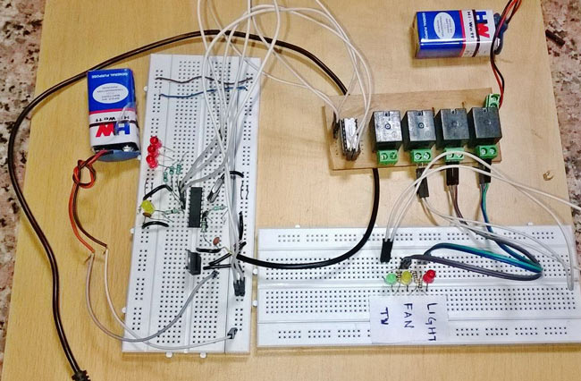
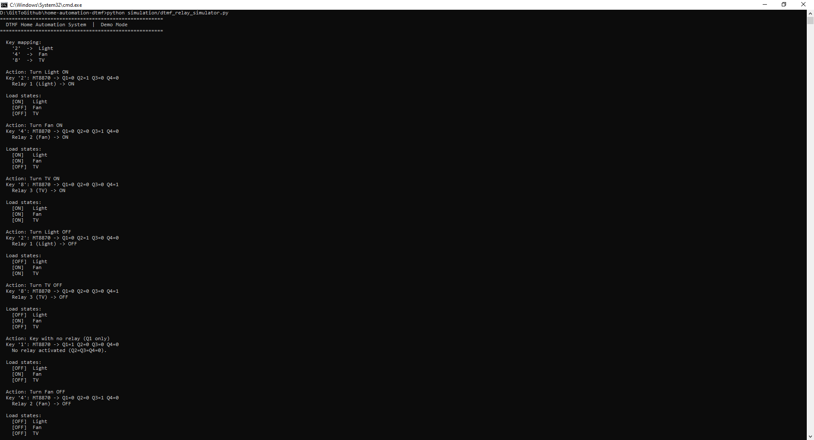
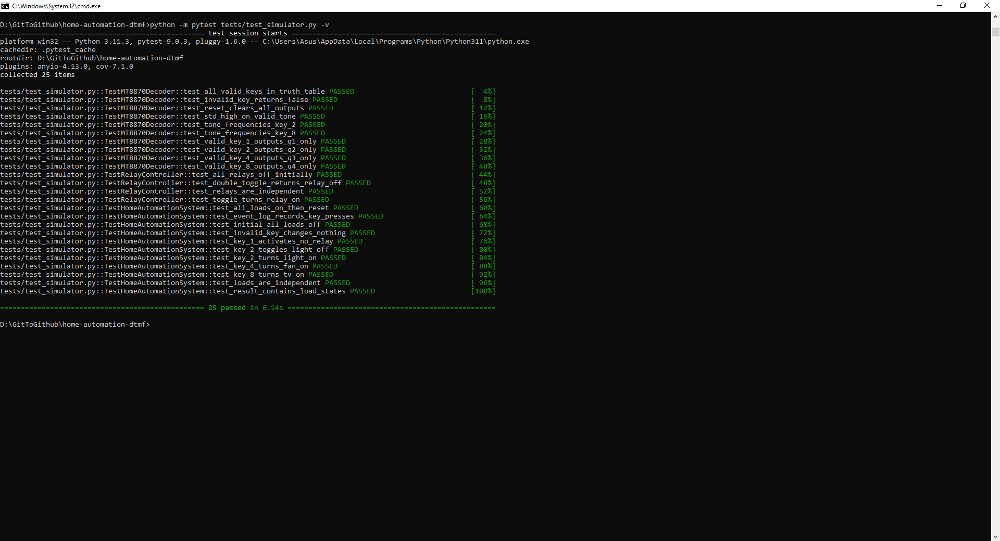

# Home Automation System using DTMF Digital Control


This project is a home automation system that controls household appliances remotely
using Dual Tone Multi-Frequency (DTMF) telephone signals. The idea came from a simple
problem: you should not have to get up and walk to a switch just to turn off a light or
a fan. By connecting a mobile phone to the circuit via an AUX wire and pressing a
designated key, the corresponding appliance turns ON or OFF instantly.

The entire system is built using digital logic components only. No microcontroller,
no Arduino, and no firmware is involved. The MT8870 DTMF decoder IC does all the work
in hardware.

---

## Hardware Prototype



The completed breadboard circuit with the MT8870 decoder, ULN2003 relay driver, and
three relay outputs controlling loads labelled TV, FAN, and LIGHT.

---

## Table of Contents

- [How It Works](#how-it-works)
- [Key Mapping](#key-mapping)
- [Components](#components)
- [Circuit Connections](#circuit-connections)
- [Software Simulation](#software-simulation)
- [Simulation Output](#simulation-output)
- [Running the Simulation](#running-the-simulation)
- [Project Structure](#project-structure)
- [Team](#team)
- [Academic Context](#academic-context)
- [References](#references)

---

## How It Works

When a key is pressed on the phone keypad, the phone produces a DTMF tone made of two
combined audio frequencies. This tone travels through the AUX wire into the MT8870
DTMF decoder IC. The decoder identifies which key was pressed and outputs a 4-bit binary
code on its Q1, Q2, Q3, and Q4 pins.

The Q2, Q3, and Q4 outputs are connected to the ULN2003 Darlington transistor array,
which drives three relay switches. Each relay controls one load. When a relay is
activated, it closes the circuit for the connected appliance and switches it ON.
Pressing the same key again deactivates the relay and switches the appliance OFF.

```
Mobile phone (AUX wire)
        |
        v
MT8870 DTMF Decoder IC  <--  3.57 MHz Crystal Oscillator
        |
   Q2   Q3   Q4
    |    |    |
        v
ULN2003 Darlington Transistor Array  <--  7805 Voltage Regulator
    |    |    |
Relay1 Relay2 Relay3
    |    |    |
  Light  Fan  TV
```

---

## Key Mapping

| Phone Key | MT8870 Output (Q1 Q2 Q3 Q4) | Relay | Load  |
|-----------|------------------------------|-------|-------|
| 2         | 0  1  0  0                   | 1     | Light |
| 4         | 0  0  1  0                   | 2     | Fan   |
| 8         | 0  0  0  1                   | 3     | TV    |

Press a key once to turn the appliance ON. Press the same key again to turn it OFF.

---

## Components

| No. | Component                   | Qty | Purpose                                        |
|-----|-----------------------------|-----|------------------------------------------------|
| 1   | MT8870 DTMF Decoder IC      | 1   | Decodes DTMF tone to 4-bit binary output       |
| 2   | ULN2003 Darlington Array    | 1   | Drives relay coils from logic-level signals    |
| 3   | 5V Relay                    | 3   | Switches loads ON/OFF (Light, Fan, TV)         |
| 4   | 7805 Voltage Regulator      | 1   | Provides stable 5V from 9V battery             |
| 5   | 3.57 MHz Crystal Oscillator | 1   | Clock reference for MT8870 decoding            |
| 6   | 9V Battery                  | 2   | Power supply                                   |
| 7   | LED                         | 3   | Visual indicator per relay channel             |
| 8   | 100K Ohm Resistor           | 2   | Input signal conditioning                      |
| 9   | 330K Ohm Resistor           | 1   | Signal conditioning                            |
| 10  | 1K Ohm Resistor             | 6   | LED current limiting                           |
| 11  | 0.1 uF Capacitor            | 2   | Decoupling                                     |
| 12  | 22 pF Capacitor             | 2   | Crystal oscillator load capacitors             |
| 13  | AUX Wire (3.5mm)            | 1   | Carries DTMF audio from phone to circuit       |
| 14  | Breadboard                  | 2   | Prototyping base                               |
| 15  | Terminal Block (PVT)        | 4   | Relay output connections to loads              |
| 16  | Connecting Wires            | --  | Jumper wires for breadboard connections        |

### Component Images

| MT8870 DTMF Decoder IC | ULN2003 Darlington Array |
|------------------------|--------------------------|
|  |  |

| 5V Relay Module | 7805 Voltage Regulator |
|-----------------|------------------------|
|  |  |

| 3.57 MHz Crystal Oscillator |
|-----------------------------|
|  |

---

## Circuit Connections

1. Connect the AUX wire from the mobile phone headphone jack to the IN+ and IN- pins
   of the MT8870.
2. Connect a 100K resistor to the IN- pin and a 0.1 uF capacitor for input signal
   conditioning.
3. Connect OSC pins 7 and 8 of the MT8870 to the 3.57 MHz crystal. Ground each side
   of the crystal through a 22 pF capacitor.
4. Connect Q2, Q3, and Q4 output pins of the MT8870 through 1K resistors and LEDs to
   ULN2003 input pins 5, 6, and 7.
5. Connect the 7805 regulator: 9V battery to input, 5V output to VCC of MT8870 and
   COM of ULN2003. Also connect 5V to relay coil pin 2 on all three relays.
6. Connect ULN2003 output pins to relay coil pin 1 on each relay.
7. Connect relay switching contacts through terminal blocks to the load appliances.

---

## Software Simulation

The actual hardware circuit works without any code. However, a Python simulation was
written to model the circuit behaviour in software. It is useful for understanding the
logic of the circuit and for documentation purposes.

The simulation follows the same signal path as the hardware:

```
MT8870 (mt8870.py)  ->  ULN2003 driver  ->  RelayController
```

| File | Description |
|------|-------------|
| simulation/mt8870.py | Software model of the MT8870 IC with full 4-bit truth table and DTMF frequency reference for all 16 keys |
| simulation/dtmf_relay_simulator.py | Main controller connecting the decoder, driver, and relays. Supports demo and interactive modes |
| tests/test_simulator.py | 25 unit tests covering MT8870 decoding, relay toggling, load independence, and system reset |

---

## Simulation Output

### Demo Mode



Each key press shows the MT8870 4-bit binary output, which relay was activated, and
the resulting state of all three loads after the key press.

### Unit Test Results



All 25 unit tests pass, confirming that the simulation correctly models the hardware
circuit behaviour across all test cases.

---

## Running the Simulation

Python 3 is required. No external libraries are needed beyond pytest for running tests.

```bash
pip install pytest

python simulation/dtmf_relay_simulator.py

python simulation/dtmf_relay_simulator.py --interactive

python -m pytest tests/test_simulator.py -v
```

---

## Project Structure

```
home-automation-dtmf/
├── README.md
├── requirements.txt
├── .gitignore
├── simulation/
│   ├── mt8870.py
│   └── dtmf_relay_simulator.py
├── tests/
│   └── test_simulator.py
├── docs/
│   ├── circuit_description.md
│   └── bill_of_materials.csv
├── Documents/
│   ├── Home_Automation_Final_Report.docx
│   └── Home_Automation_Final_Report.pdf
└── images/
    ├── prototype.jpg
    ├── MT8870 DTMF Decoder IC.PNG
    ├── ULN2003 Darlington Array (Texas Instruments).jpg
    ├── 5V Relay Module.jpg
    ├── 7805 Voltage Regulator.jpg
    ├── 3.57 MHz Crystal Oscillator.jpeg
    ├── basic connection diagram.png
    ├── DTMF.jpg
    ├── simulation_demo_output.PNG
    ├── simulation_test_output.PNG
    └── Folder Structure.PNG
```

---

## Team

| Name                           | Student ID  |
|--------------------------------|-------------|
| Sazzad Hossain                 | 1610139042  |
| Md. Moniruzzaman Firoz         | 1511198042  |
| Mohammad Abdullah Siddiky      | 1620641042  |
| Nurun Naima Most. Shahera Tuly | 1620617042  |

---

## Academic Context

| Detail | Info |
|--------|------|
| Course | CSE231 Digital Logic Design |
| Department | Electrical and Computer Engineering |
| Institution | North South University, Bangladesh |
| Semester | Spring 2018 |
| Supervisor | Rishad Arfin (RSF) |

---

## References

- MT8870 DTMF Decoder Datasheet, Zarlink Semiconductor
- ULN2003A Datasheet, Texas Instruments
- LM7805 Voltage Regulator Datasheet, Texas Instruments
- DTMF-Based Home Automation System, Circuit Digest. https://circuitdigest.com/electronic-circuits/dtmf-based-home-automation-system
- Home Automation, Wikipedia. https://en.wikipedia.org/wiki/Home_automation
- Morris Mano, Digital Logic and Computer Design, Pearson Education
